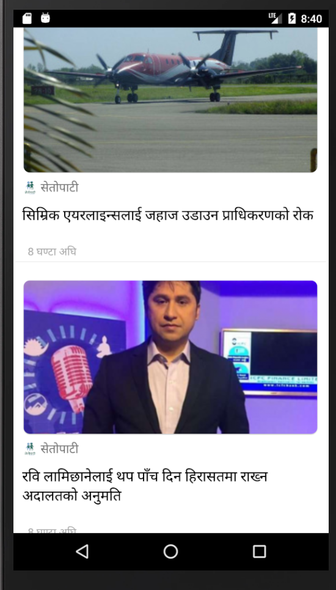

# Nepal Today App

# latest image

## Tips
* Run `yarn relay` to compile graphql in relay. [It needs to be compiled before running the app]
* Run `yarn a` to run the app in android
* Run `yarn refresh` to reload android app quickly without rebuilding
* Run `yarn reset` to reset package manager cache
* Run `adb shell settings put global verifier_verify_adb_installs 0` to disable apk verification
* Run `adb shell settings put global package_verifier_enable 0` to disable package verification
* Run `adb uninstall com.siristechnology.nepaltodayapp` to uninstall app from the android simulator
* Run `adb logcat` to view android emulator logs in terminal
