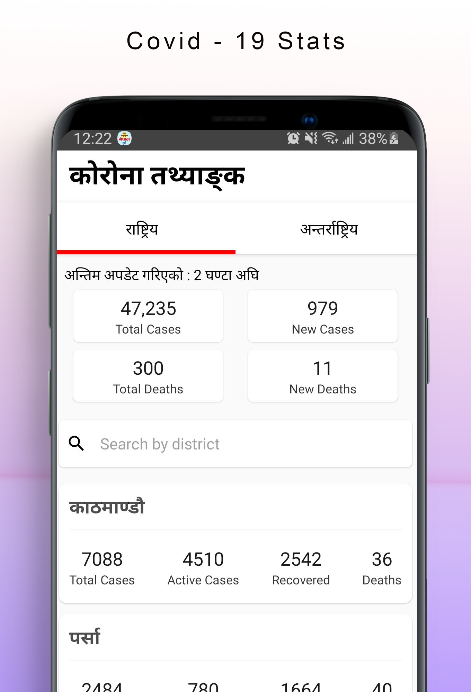

# Nepal Today App

## Latest screenshot

## How to Run locally

-   Install Android Studio
-   Install node (10.x), yarn (1.x)
-   Install concurrently globally. `yarn global add concurrently`
-   Run Android emulator. (from Android Studio or Genymotion)
-   Compile Relay Graphql. `yarn relay`
-   Run the app. `yarn start:dev`

## Tips

-   Run `yarn relay` to compile graphql in relay. [It needs to be compiled before running the app]
-   Run the app using concurrently. `yarn start:dev`
-   Run `yarn a` to run the app in android without concurrently
-   Run `yarn refresh` to reload android app quickly without rebuilding
-   Run `yarn reset` to reset package manager cache
-   Run `adb uninstall com.siristechnology.nepaltodayapp` to uninstall app from the android simulator
-   Run `adb logcat` to view android emulator logs in terminal
